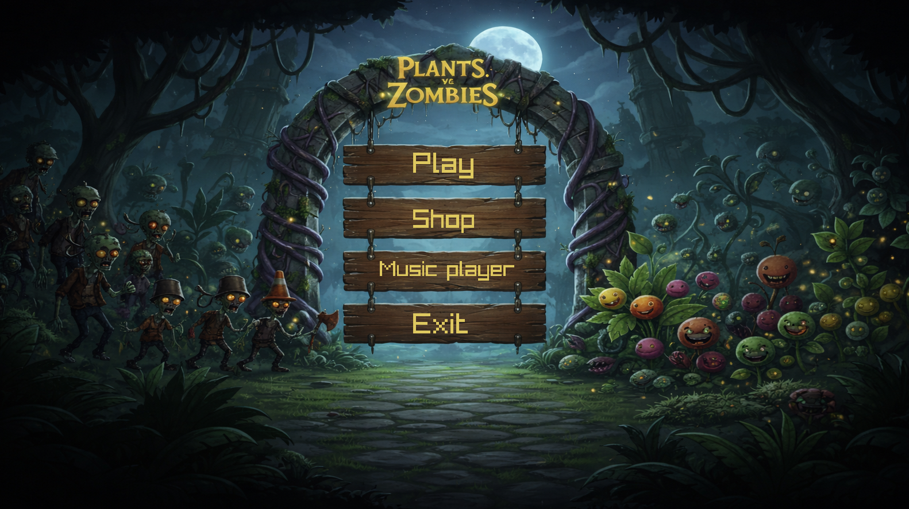
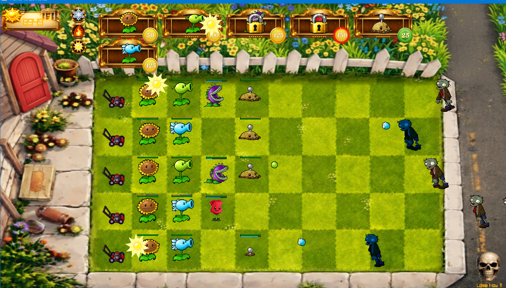

# 🌻 Plants vs Zombies — BP Project

A fan-made clone of **Plants vs Zombies** built in **C** using the [raylib](https://www.raylib.com/) library.

---

## 📸 Screenshots




---

## 🎮 Features

- 4 playable levels
- Multiple plants: Peashooter, Sunflower, Chomper, Rose, Potato Mine
- Shop system to buy plants
- Level select screen
- Music player with in-game soundtrack
- Lawn mower defense mechanic
- GIF animation support
- Save system

---

## 🚀 Quick Start

> No build tools needed — just download and run.

1. Go to the [**Releases**](../../releases) page
2. Download the latest release
3. Extract the zip
4. Run `PlantsVsZombies.exe`

> **Note:** The `assets/` folder must stay in the **same directory** as the executable.

---

## 🛠️ Build from Source

This project uses **C** and **[raylib](https://www.raylib.com/)**, so it can be built on **Windows, Linux, and macOS**.

### Step 1 — Install raylib

Download and install raylib from the official website or package manager:

- **Windows:** Download from [raylib.com](https://www.raylib.com/) or use `winget install raylib`
- **Linux:** `sudo apt install libraylib-dev` or build from source
- **macOS:** `brew install raylib`

### Step 2 — Clone the repo

```bash
git clone https://github.com/OmidBehzadpoor/Plants-vs-Zombies.git
cd Plants-vs-Zombies
```

### Step 3 — Configure CMake with raylib path

**Windows (MinGW):**

```bash
mkdir build && cd build
cmake .. -G "MinGW Makefiles" -DCMAKE_PREFIX_PATH="C:/path/to/raylib"
cmake --build . --config Release
```

**Linux / macOS:**

```bash
mkdir build && cd build
cmake ..
cmake --build . --config Release
```

> Make sure CMake can find raylib headers (`raylib.h`) and the library. If raylib is installed system-wide, CMake will find it automatically.

### Step 4 — Run

After building, the executable is in the `build/` folder. Make sure the `assets/` folder is accessible relative to it:

```
build/
  PlantsVsZombies.exe   ← run this
../assets/              ← assets are loaded from here automatically
```

---

## 📁 Project Structure

```
Plants-vs-Zombies/
├── Source/          # All .c source files
│   ├── PlantsVsZombies.c   # Entry point (main)
│   ├── GameLoop.c          # Main game loop & screen state machine
│   ├── Level1–4.c          # Individual level logic
│   ├── Zombie.c / Plant.c  # Entity logic
│   ├── Shop.c              # Shop system
│   ├── menu.c              # Main menu
│   └── ...
├── include/         # Header files
├── assets/          # Textures, fonts, sounds, GIFs
├── Data/            # Save data
└── CMakeLists.txt
```

---

## 🧑‍💻 For Developers / Contributors

If you want to continue development, additional raw assets (fonts, images, GIFs, audio) are available in the **Developer Assets** pre-release:

👉 [Download Dev Assets](../../releases)

> Regular players do **not** need these files.
